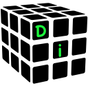

#  ZenIoc
Fast Friendly Dependency Injection

[](https://htmlpreview.github.io/?https://raw.githubusercontent.com/zenmvvm/ZenIoc/develop/coverage/index.html) [](https://www.nuget.org/packages/ZenIoc/)

* **Fast**. ZenIoc was designed to be used in mobile apps. As such, quick resolving of dependencies is important.
* **Feature-Rich**. ZenIoc offers advanced features, without compromising on performance. ZenIoc supports:
  * [Constructor selection](https://github.com/zenmvvm/ZenIoc/wiki/Registration#constructor-selection): If multiple constructors, can control which one is used to build the object.
  * [Property Injection](https://github.com/zenmvvm/ZenIoc/wiki/Registration#linq-expressions): Objects which require property injection are resolved
  * [Generics](https://github.com/zenmvvm/ZenIoc/wiki/Registration#open-generic-types): Objects with a generic dependency are resolved
  * [IEnumerables](https://github.com/zenmvvm/ZenIoc/wiki/Registration#ienumerable): Several objects that implement the same interface are resolved into an Enumerable of that interface
  * Conditional / [Named dependencies](https://github.com/zenmvvm/ZenIoc/wiki/Registration#named-registrations): Objects with a conditional dependency are resolved
  * [Child Containers](https://github.com/zenmvvm/ZenIoc/wiki#child-containers): Objects can be scoped to a child container. Nesting of child containers is supported
* **Friendly**. ZenIoc offers a simple API and convenience:
  * [Smart-Resolve](https://github.com/zenmvvm/ZenIoc/wiki/Resolution#smart-resolve) will attempt to resolve an unregistered dependency
  * Singleton implementation for simple applications
  * Attribute decorators which simplify constructor selection and conditional resolution

## QuickStart

If you are new to DI, see [Why Di](#why-di?) below. The easiest way to get started is to use ZenIoc's singleton implementation. This will give access to the container throughout your app by calling `IocContainer`. 

```c#
using ZenIoc;

//Register
IocContainer.Register<IBrewEquipment,FrenchPress>();

//Resolve
var frenchPress = IocContainer.Resolve<IBrewEquipment>();
```

For more details, [browse the wiki](https://github.com/zenmvvm/ZenIoc/wiki).

### Example

The following example instantiates two coffee-making robots. Both CoffeeRobots share the same `FilteredWater` (registered as a singleton), and use their own`IBrewEquipment` to make coffee. In this implementation, we give the robots a `FrenchPress` which implements `IBrewEquipment`. Executable code below:

```c#
using System;
using ZenIoc;

public class CoffeeRobot
{
    public CoffeeRobot(IBrewEquipment equipment, FilteredWater water)
    {
        Console.WriteLine("Ready to brew using "
            + equipment + equipment.Instances
            +" and "
            + water + water.Instances);
    }
}

public interface IBrewEquipment { int Instances { get; } }
public class FrenchPress : IBrewEquipment
{
    static int instances;
    public int Instances => instances;
    public FrenchPress() { instances++; }
}

public class FilteredWater
{
    static int instances;
    public int Instances => instances;
    public FilteredWater() { instances++; }
}

public class Program
{
    static void Main(string[] args)
    {
        IocContainer.Register<FilteredWater>().SingleInstance(); //Singleton
        IocContainer.Register<IBrewEquipment,FrenchPress>();
        IocContainer.Register<CoffeeRobot>();

        var robot1 = IocContainer.Resolve<CoffeeRobot>();
        var robot2 = IocContainer.Resolve<CoffeeRobot>();
        var robot3 = IocContainer.Resolve<CoffeeRobot>();
        var robot4 = IocContainer.Resolve<CoffeeRobot>();
        var robot5 = IocContainer.Resolve<CoffeeRobot>();
    }
}

//Output:
//Ready to brew using FrenchPress1 and FilteredWater1
//Ready to brew using FrenchPress2 and FilteredWater1
//Ready to brew using FrenchPress3 and FilteredWater1
//Ready to brew using FrenchPress4 and FilteredWater1
//Ready to brew using FrenchPress5 and FilteredWater1
```

ZenIoc has a convenient [Smart Resolve](https://github.com/zenmvvm/ZenIoc/wiki/Resolution#smart-resolve) feature. This lets the user resolve instances that haven't been registered in the container. The above code can be reduced to:

```c#
//SMART-RESOLVE
public class Program
{
  static void Main(string[] args)
  {
    //No Registration needed
    var robot1 = IocContainer.Resolve<CoffeeRobot>();
    var robot2 = IocContainer.Resolve<CoffeeRobot>();
    var robot3 = IocContainer.Resolve<CoffeeRobot>();
    var robot4 = IocContainer.Resolve<CoffeeRobot>();
    var robot5 = IocContainer.Resolve<CoffeeRobot>();
  }
}

//Output:
//Ready to brew using FrenchPress1 and FilteredWater1
//Ready to brew using FrenchPress1 and FilteredWater2
//Ready to brew using FrenchPress1 and FilteredWater3
//Ready to brew using FrenchPress1 and FilteredWater4
//Ready to brew using FrenchPress1 and FilteredWater5
```

> :memo: Note that the ZenIoc resolves in a different lifecycle for the objects. Interfaces will be assumed to be Singletons and Types assumed to be Transient.

## Why DI?

> Skip to the [Wiki page](https://github.com/zenmvvm/ZenIoc/wiki) for documentation if you're already familiar with Di / Ioc.

Depenedency Injection addresses the creation of objects and their dependencies. This technique results in **loose coupling** between objects and their dependencies. Coupling between objects refers to the degree of knowledge that one object has of another one. So loose coupling means that objects are as independent of each other as possible. Using this technique results in **programs that are easily and safely modified**. A bonus side-effect is that your **code is more readable** because each object's dependencies are explicitly defined. 

You don't need ZenIoc to implement this technique. But if you do it by hand, you find yourself writing lots of boilerplate code. ZenIoc manages all the objects in your app and their interdependencies in one place. This reduces the code-overhead, and reduces complexity. 

The technique is best understood using a simple example. We start with a tightly coupled app, CoffeeRobot. We will program CoffeeRobot to brew us a plunger coffee using a French Press.

```c#
using System;

public class FrenchPress
{
    public void Brew(string coffeeBeans)
    {
        Console.WriteLine("Plunging " + coffeeBeans);
    }
}

public class CoffeeRobot
{
    public CoffeeRobot() { }

    public void BrewCoffee(string coffeBeans)
    {
        var frenchPress = new FrenchPress();
        frenchPress.Brew(coffeBeans);
        Console.WriteLine("Here's your hit of caffeine!");
    }
}

public class Program
{
    static void Main(string[] args)
    {
        var robot = new CoffeeRobot();
        robot.BrewCoffee("Yirgacheffe Arabica");
    }
}
```

But we've just been given a [Chemex](https://www.chemexcoffeemaker.com), and want the Robot to make us pour-over coffee. This would result in a complete rewrite / duplication of code.

If we had abstracted the brew method into an interface `IBrewEquipment` that has the `BrewCoffee(CoffeGrounds grounds)` method. Things would be alot simpler. Furthermore, if we pass `IBrewEquipment` to the CoffeRobot constructor, we can more easily swap it out for the Chemex. Below is the refactored code implementing the FrenchPress (changes indicated by `//<--`).

```c#
using System;

public interface IBrewEquipment //<--
{
    void Brew(string coffeeBeans);
}

public class FrenchPress : IBrewEquipment
{
    public void Brew(string coffeeBeans)
    {
        Console.WriteLine("Plunging " + coffeeBeans);
    }
}

public class CoffeeRobot
{
    IBrewEquipment equipment; //<--
    public CoffeeRobot(IBrewEquipment equipment) //<--
    {
        this.equipment = equipment;
    }

    public void BrewCoffee(string coffeBeans)
    {
        equipment.Brew(coffeBeans); //<--
        Console.WriteLine("Here's your hit of caffeine!");
    }
}

public class Program
{
    static void Main(string[] args)
    {
        var robot = new CoffeeRobot(new FrenchPress()); //<--
        robot.BrewCoffee("Yirgacheffe Arabica");
    }
}
```

Adding a few lines, we can implement the Chemex option:

```c#
public class Chemex : IBrewEquipment
{
    public void Brew(string coffeeBeans)
    {
      Console.WriteLine("Pouring " + coffeeBeans);
    }
}
```

And to get our Chemex coffee, we modify Program as follows:

```c#
public class Program
{
    static void Main(string[] args)
    {
        var robot = new CoffeeRobot(new Chemex()); //<--
        robot.BrewCoffee("Yirgacheffe Arabica");
    }
}
```

Now, the overhead of doing this is pretty low for a simple application. But what if you had 5 CoffeeRobots serving customers? And we had a more realistic implementation where the robots share a single water-source, use a coffee grinder, and have filter papers for their Chemex. The implementation would look something like this:

```c#
public class Program
{
    static void Main(string[] args)
    {
        var water = new FilteredWater();

        var robot1 =
          new CoffeeRobot(new Chemex(new FilterPaper()), water, new Grinder());
        var robot2 =
          new CoffeeRobot(new Chemex(new FilterPaper()), water, new Grinder());
        var robot3 =
          new CoffeeRobot(new Chemex(new FilterPaper()), water, new Grinder());
        var robot4 =
          new CoffeeRobot(new Chemex(new FilterPaper()), water, new Grinder());
        var robot5 =
          new CoffeeRobot(new Chemex(new FilterPaper()), water, new Grinder());

        robot1.BrewCoffee("Yirgacheffe Arabica");
    }
}
```

Ok, still not too bad... but what if we gave all our robots French Presses? This would result in refactoring 5 lines of code.... and for 100 robots, the refactoring would involve 100 lines. By using ZenIoc, we can reduce this change to only one line, regardless of the number of robots. Also note how clean and readable the code looks.

```c#
public class Program
{
    static void Main(string[] args)
    {
        IocContainer.Register<Water, FilteredWater>().SingleInstance();

        //ZenIoc will automatically resolve the FilterPaper for the Chemex
        IocContainer.Register<IBrewEquipment, Chemex>();
        IocContainer.Register<Grinder>();
        IocContainer.Register<CoffeeRobot>();

        var robot1 = IocContainer.Resolve<CoffeeRobot>();
        var robot2 = IocContainer.Resolve<CoffeeRobot>();
        var robot3 = IocContainer.Resolve<CoffeeRobot>();
        var robot4 = IocContainer.Resolve<CoffeeRobot>();
        var robot5 = IocContainer.Resolve<CoffeeRobot>();

        robot1.BrewCoffee("Yirgacheffe Arabica");
    }
}
```

To change to French Press, we only modify one line:

```c#
 ZenIoc.Register<IBrewEquipment, FrenchPress>(); 
```

Its easy to give some robots a French Press and others a Chemex:

```c#
public class Program
{
    static void Main(string[] args)
    {
        IocContainer.Register<Water, FilteredWater>().SingleInstance();

        IocContainer.RegisterExplicit<CoffeeRobot,CoffeeRobot>(
          c => new CoffeeRobot(
                    new Chemex(new FilterPaper()),
                    IocContainer.Resolve<Water>(),
                    new Grinder()),
          "pour_over");

        IocContainer.RegisterExplicit<CoffeeRobot,CoffeeRobot>(
          c => new CoffeeRobot(
                    new FrenchPress(),
                    IocContainer.Resolve<Water>(),
                    new Grinder()),
          "plunger");

        var robot1 = IocContainer.Resolve<CoffeeRobot>("pour_over");
        var robot2 = IocContainer.Resolve<CoffeeRobot>("plunger");
        var robot3 = IocContainer.Resolve<CoffeeRobot>("pour_over");
        var robot4 = IocContainer.Resolve<CoffeeRobot>("plunger");
        var robot5 = IocContainer.Resolve<CoffeeRobot>("plunger");

        Console.WriteLine();

        robot1.BrewCoffee("Yirgacheffe Arabica");
        robot2.BrewCoffee("Columbian Arabica");
        robot3.BrewCoffee("Honduran Arabica");
        robot4.BrewCoffee("Yirgacheffe Arabica");
        robot5.BrewCoffee("Guatemalan Arabica");
    }
}
```


Pulling it all together, here is the **full executable code below**:

```c#
using System;
using ZenIoc;

//Expected Output:
//Ready to brew using Chemex1 and FilteredWater1
//Ready to brew using FrenchPress1 and FilteredWater1
//Ready to brew using Chemex2 and FilteredWater1
//Ready to brew using FrenchPress2 and FilteredWater1
//Ready to brew using FrenchPress3 and FilteredWater1
//
//Pouring Yirgacheffe Arabica...Here's your hit of caffeine!
//Plunging Columbian Arabica...Here's your hit of caffeine!
//Pouring Honduran Arabica...Here's your hit of caffeine!
//Plunging Yirgacheffe Arabica...Here's your hit of caffeine!
//Plunging Guatemalan Arabica...Here's your hit of caffeine!

public abstract class Water
{
    public abstract int Instances { get; }
}

public class FilteredWater : Water
{
    static int instances;
    public override int Instances => instances;

    public FilteredWater() { instances++; }
}

public class Grinder { }

public interface IBrewEquipment
{
    int Instances { get; }
    void Brew(string coffeeBeans);
}

public class FrenchPress : IBrewEquipment
{
    static int instances;
    public int Instances => instances;
    public FrenchPress() { instances++; }

    public void Brew(string coffeeBeans)
    {
        Console.Write("Plunging " + coffeeBeans + "... ");
    }
}

public class FilterPaper { }

public class Chemex : IBrewEquipment
{
    static int instances;
    public int Instances => instances;

    public Chemex(FilterPaper paper)
    {
        _ = paper;
        instances++;
    }

    public void Brew(string coffeeBeans)
    {
        Console.Write("Pouring " + coffeeBeans + "... ");
    }
}

public class CoffeeRobot
{
    IBrewEquipment equipment;

    public CoffeeRobot(IBrewEquipment equipment, Water water, Grinder grinder)
    {
        this.equipment = equipment;
        _ = grinder;
        Console.WriteLine("Ready to brew using "
            + equipment + equipment.Instances
            + " and "
            + water + water.Instances);
    }

    public void BrewCoffee(string coffeBeans)
    {
        equipment.Brew(coffeBeans);
        Console.WriteLine("Here's your hit of caffeine!");
    }
}

public class Program
{
    static void Main(string[] args)
    {
        IocContainer.Register<Water, FilteredWater>().SingleInstance();

        IocContainer.RegisterExplicit<CoffeeRobot,CoffeeRobot>(
          c => new CoffeeRobot(
                    new Chemex(new FilterPaper()),
                    IocContainer.Resolve<Water>(),
                    new Grinder()),
          "pour_over");

        IocContainer.RegisterExplicit<CoffeeRobot,CoffeeRobot>(
          c => new CoffeeRobot(
                    new FrenchPress(),
                    IocContainer.Resolve<Water>(),
                    new Grinder()),
          "plunger");

        var robot1 = IocContainer.Resolve<CoffeeRobot>("pour_over");
        var robot2 = IocContainer.Resolve<CoffeeRobot>("plunger");
        var robot3 = IocContainer.Resolve<CoffeeRobot>("pour_over");
        var robot4 = IocContainer.Resolve<CoffeeRobot>("plunger");
        var robot5 = IocContainer.Resolve<CoffeeRobot>("plunger");

        Console.WriteLine();

        robot1.BrewCoffee("Yirgacheffe Arabica");
        robot2.BrewCoffee("Columbian Arabica");
        robot3.BrewCoffee("Honduran Arabica");
        robot4.BrewCoffee("Yirgacheffe Arabica");
        robot5.BrewCoffee("Guatemalan Arabica");
    }
}
```

